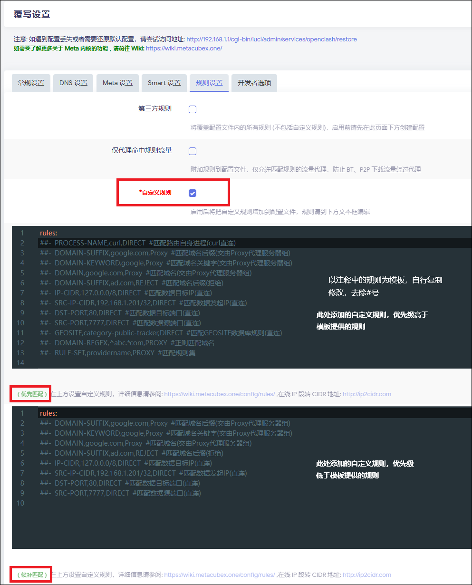

# 其他说明

> 包含插件升级脚本、个性化定制说明以及域名收录指南。

## 目录

| # | 章节 |
| :---: | :--- |
| 1 | [升级插件至 Dev 版本](#1-升级插件至-dev-版本) |
| 2 | [关于个性化需求](#2-关于个性化需求) |
| 3 | [关于小众域名收录](#3-关于小众域名收录) |

---

## 1. 升级插件至 Dev 版本

OpenClash 的 Dev 版本通常包含最新的功能修复和改进。为了简化从 Master 版本升级到 Dev 版本的流程，以及应对系统重置后的环境恢复，本项目提供了一个自动化 Shell 脚本 `install_openclash_dev_update.sh`。

该脚本旨在通过单一命令完成 OpenClash 及其依赖环境的自动化部署与更新。

### ✨ 脚本功能

脚本执行过程中将自动按序完成以下操作：

1. **环境检测**：自动识别系统包管理器（`opkg` / `apk`）及防火墙架构（`iptables` / `nftables`），并安装缺失依赖。
2. **连接优化**：按脚本逻辑更新必要的解析/Hosts 信息，以提升连接稳定性。
3. **下载优化**：通过 jsDelivr CDN 或备用下载源，提升安装包下载成功率。
4. **智能配置**：
    - 自动检测 CPU 微架构并配置最优 `core_version`。
    - 强制将内核更新分支设为 Dev。
    - 自动根据剩余空间选择适配的 LightGBM 模型（Smart 内核模式下）。
5. **资源更新**：同步更新 GeoIP、GeoSite、直连 IP 白名单等核心数据库及相关配置。
6. **配置恢复**：支持加载 `/etc/config/openclash-set` 预设文件，用于保留自定义配置。
7. **服务启动**：自动设置开机自启并启动服务。

### 📥 使用方法

> [!TIP]
> 推荐通过 SSH 连接设备，直接执行以下命令：

```bash
wget -qO- https://testingcf.jsdelivr.net/gh/Aethersailor/Custom_OpenClash_Rules@refs/heads/main/shell/install_openclash_dev.sh | sh
```

---

## 2. 关于个性化需求

本项目的 `Custom_Clash_Full.ini` 模板开放规则添加请求。

> [!WARNING]
> **注意**：随着规则数量增加，模板体积可能会增大，从而影响解析性能。本项目不对因规则过多导致的性能损耗负责。

若需要完全个性化的配置，建议采用以下方式：

### 🛠️ 推荐方案：使用 OpenClash 自定义规则

通过 OpenClash 的 **"覆写设置"** 功能添加自定义规则，是最高效且不破坏原有模板结构的方法。

**操作路径：**
`OpenClash` > `覆写设置` > `规则设置` > `自定义规则`

勾选"自定义规则"，并按照标准 Clash 规则格式添加内容（需去除 `#` 注释符）。



### 其他方案

- **Fork 修改**：Fork 本仓库，自行修改并维护模板文件。
- **规则附加**：使用 OpenClash 的"规则附加"功能。

---

## 3. 关于小众域名收录

为了优化分流体验，本项目持续收集被误分流的小众域名。

符合上游要求的域名将被提交至 [felixonmars/dnsmasq-china-list](https://github.com/felixonmars/dnsmasq-china-list)，最终合并进 GeoSite 数据库（[Loyalsoldier/v2ray-rules-dat](https://github.com/Loyalsoldier/v2ray-rules-dat)），实现不经内核的直连访问。

### ✅ 收录标准

提交的域名需满足以下条件：

1. **解析为 Fake-IP**：域名经过 OpenClash 解析返回 Fake-IP。
2. **分流异常**：未命中任何直连规则，被分流至"漏网之鱼"（Final）策略组。

建议同时满足以下条件：

1. **解析为特定区域 IP 地址**：域名解析结果为 CN IP 地址。

### 📮 提交方式

#### 方式一：提交 Pull Request

直接向本仓库的 `rules/Custom_Direct.list` 文件提交 PR。

#### 方式二：Issue 反馈

在 GitHub Issues 中反馈。

#### 方式三：Telegram 机器人（推荐）

通过 [**COCR RULE BOT**](https://t.me/asailor_rulebot) 进行提交。

### 💡 处理流程说明

> [!NOTE]
> 说明：
>
> 1. **提交说明**：提交时请注明域名对应的网站名称，将优先收录至本项目的直连规则中。
> 2. **上游检测**：维护者将校验域名是否符合上游收录标准（例如 NS/归属信息等）。
>     - **符合**：提交 PR 至 GeoSite 上游。被收录后，OpenClash 将按直连逻辑并绕过内核处理。
>     - **不符合**：永久保留在本项目的直连规则中，由内核处理。
> 3. **规则清理**：域名被 GeoSite 正式收录后，将从本项目的直连规则中移除。
